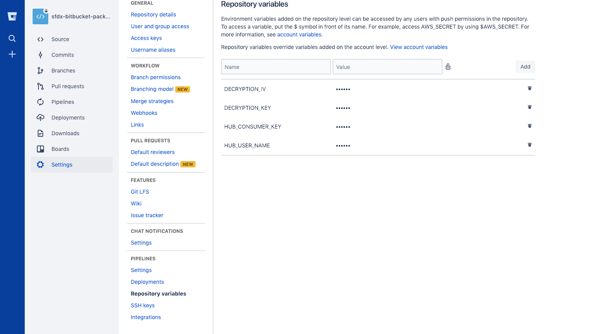

# sfdx-bitbucket-package 

Coming Soon --- For a fully guided walk through of setting up and configuring this sample, see the [Continuous Integration Using Salesforce DX](https://trailhead.salesforce.com/modules/sfdx_travis_ci) Trailhead module.

This repository shows one way you can successfully setup Salesforce DX to create new package versions with Bitbucket Pipelines. We make a few assumptions in this README:

- You know how to get your Bitbucket repository setup with Bitbucket Pipelines. (Here's their [Getting Started guide](https://confluence.atlassian.com/bitbucket/get-started-with-bitbucket-pipelines-792298921.html).)
- You have properly setup JWT-Based Authorization Flow (i.e. headless). I recommend using [these steps for generating your Self-Signed SSL Certificate](https://devcenter.heroku.com/articles/ssl-certificate-self). 

If any any of these assumptions aren't true, the following steps won't work.

## Getting Started
1) [Fork](http://help.github.com/fork-a-repo/) this repo into your github account using the fork link at the top of the page.

2) Clone your forked repo locally: `git clone https://github.com/<git_username>/sfdx-bitbucket-package.git`

3) Make sure you have the Salesforce CLI installed. Check by running `sfdx force --help` and confirm you see the command output. If you don't have it installed, you can download and install it from [here](https://developer.salesforce.com/tools/sfdxcli).

4) Setup a JWT-based auth flow for the target orgs that you want to deploy to.  This step will create a server.key file that will be used in subsequent steps.
(https://developer.salesforce.com/docs/atlas.en-us.sfdx_dev.meta/sfdx_dev/sfdx_dev_auth_jwt_flow.htm)

5) Confirm you can perform a JWT-based auth: `sfdx force:auth:jwt:grant --clientid <your_consumer_key> --jwtkeyfile server.key --username <your_username> --setdefaultdevhubusername`

   **Note:** For more info on setting up JWT-based auth see [Authorize an Org Using the JWT-Based Flow](https://developer.salesforce.com/docs/atlas.en-us.sfdx_dev.meta/sfdx_dev/sfdx_dev_auth_jwt_flow.htm) in the [Salesforce DX Developer Guide](https://developer.salesforce.com/docs/atlas.en-us.sfdx_dev.meta/sfdx_dev).

6) Encrypt and store the server.key generated above using the instructions below.  IMPORTANT!  You will want to ensure that you do not store the server.key within the project.

- First, we will generate a key and initializtion vector (iv) to encrypt your server.key file locally.  The key and iv will be used by Bitbucket Pipeplines to decrypt your server key in the build environment.


```bash
$ openssl enc -aes-256-cbc -k <passphrase here> -P -md sha1 -nosalt
  key=E5E9FA1BA31ECD1AE84F75CAAA474F3A663F05F412028F81DA65D26EE56424B2
  iv =E93DA465B309C53FEC5FF93C9637DA58
```

> Make note of the `key` and `iv` values output to the screen. You will use the values following `key=` and `iv =` to encrypt your `server.key` in the next step.

- Encrypt the `server.key` using the newly generated `key` and `iv` values.  The `key` and `iv` values *should* only be used once, don't use them to encrypt more than the `server.key`.  While you can re-use this pair to encrypt other things, it is considered a security violation to do so.  Every time you run the command above, a new `key` and `iv` value will be generated.  IE, you can not regenerated the same pair, so if you lose these values you will need to generated new ones and encrypt again.

```bash
openssl enc -nosalt -aes-256-cbc -in assets/server.key -out assets/server.key.enc -base64 -K <key from above> -iv <iv from above>
```
 This should have replaced the existing server.key.enc with your encrypted version.

- Store the `key`, and `iv` values somewhere safe, you will need these in values in a subsequent step in the Bitbucket Pipeplines UI. These valus are considered *secret* so please treat them as such.

7) From your JWT-Based connected app on Salesforce, retrieve the generated `Consumer Key`. This should be from your DevHub org.

8) Set your `Consumer Key` in a Bitbucket Pipelines environment variable named `HUB_CONSUMER_KEY` using the Bitbucket Pipelines UI. Set your `Username` in a Bitbucket Pipelines environment variable named `HUB_USER_NAME` using the Bitbucket Pipelines UI.  Note that this username is the username that you use to access your Dev Hub.

9) Store the `key` and `iv` values used above in Bitbucket Pipelines environment variables named `DECRYPTION_KEY` and `DECRYPTION_IV` respectively.  When finished setting environment variables you environment variables setup screen should look like the one below.



10) Copy all the contents of package-sfdx-project.json into sfdx-project.json and save.

11) Create the sample package running this command `sfdx force:package:create -r force-app/main/default/ -n "BitbucketPipelines" -d "Bitbucket Pipelines Package Example" -t Unlocked`

12) Create the first package version `sfdx force:package:version:create --package "BitbucketPipelines" --installationkeybypass --wait 10 --json --targetdevhubusername HubOrg`

13) In the config.yml Update the value in the `PACKAGENAME` variable to be Package Id in your sfdx-project.json file.  This id will start with 0Ho.

14) Commit the updated `sfdx-project.json`,`config.yml`, and `server.key.enc` files.

And you should be ready to go! Now when you commit and push a change, your change will kick off a Bitbucket Pipelines build.

Enjoy!

## Contributing to the Repository ###

If you find any issues or opportunities for improving this repository, fix them!  Feel free to contribute to this project by [forking](http://help.github.com/fork-a-repo/) this repository and make changes to the content.  Once you've made your changes, share them back with the community by sending a pull request. Please see [How to send pull requests](http://help.github.com/send-pull-requests/) for more information about contributing to Github projects.

## Reporting Issues ###

If you find any issues with this demo that you can't fix, feel free to report them in the [issues](https://github.com/forcedotcom/sfdx-bitbucket-package/issues) section of this repository.